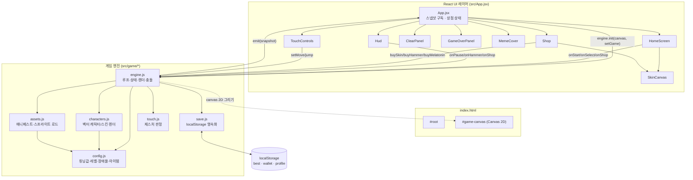
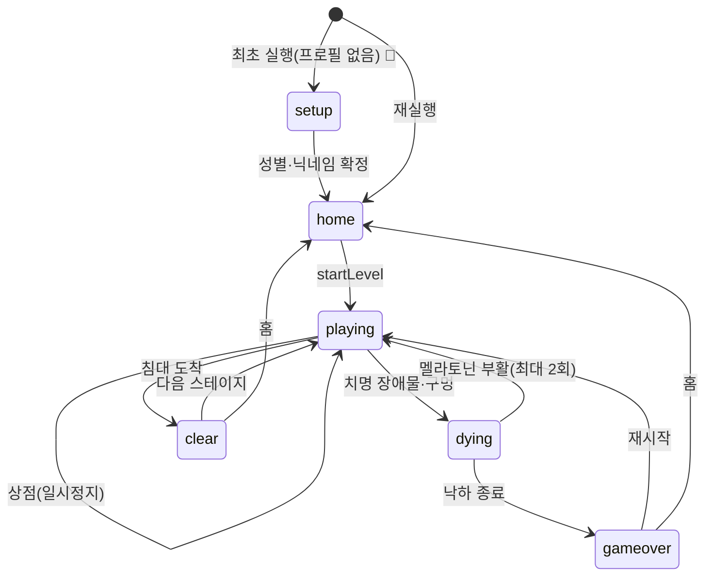

# 꿀잠 러너 — 앱 설계서 (App Design Document)

> **버전** v1.0 · **작성일** 2026-09-29 · **대상** 출시 준비(iOS/Android WebView·웹)
> **한 줄 소개** 방해꾼을 피해 침대까지 달려가 꿀잠을 자는, 실내→꿈나라 원근 터널 러너.
> **스택** React 18 + Vite 5 · 순수 Canvas 2D 게임 엔진(외부 게임 엔진 없음) · Vercel 정적 배포.

이 문서는 현재 구현된 내용과 출시를 위한 목표 사양을 함께 담는다.
각 항목의 상태를 다음 배지로 표시한다: **✅ 구현됨** · **🚧 작업 중** · **📝 설계(예정)**.

---

## 1. 개요 & 코어 루프

- **장르**: 3D 원근 터널 엔드리스/스테이지 러너 (Run 계열 조작감 + "잠들기" 테마)
- **목표**: 각 스테이지에서 방해꾼·구멍을 피해 **침대(골인)** 까지 완주 → 클리어 → 코인 보상 + 다음 스테이지 해금
- **코어 루프**:
  1. 홈에서 스테이지 선택 → 자동 전진 시작
  2. 좌우 이동 / 점프 / 벽 타기(중력 전환)로 장애물 회피
  3. 별사탕(코인) 획득, 함정 음료·밈·유령 주의
  4. 침대 도착 → 클리어 연출(이불·Zzz) → 코인·해금
  5. 코인으로 상점에서 스킨·아이템 구매 → 다시 도전
- **세션 길이**: 스테이지당 약 30초~90초 (goal 300m~1500m)

---

## 2. 앱 구조도 (런타임 아키텍처) ✅

Canvas 게임 엔진은 React 바깥에서 60fps 루프로 돌고, React는 엔진이 통지하는
**스냅샷(snapshot)** 으로 UI 레이어만 그린다. 입력은 엔진이 직접(키보드) 또는 React를
경유(터치/버튼)해 엔진 액션을 호출한다.



**핵심 원칙**
- 게임 상태의 단일 소유자는 `engine.js`. React는 파생 뷰만 렌더(단방향).
- `emit()` 은 스냅샷 키가 실제로 바뀔 때만 통지 → 60fps 리렌더 방지.
- 데이터(레벨·장애물·아이템·스킨)는 전부 `config.js`/`manifest.json`에 선언 → **데이터 주도**.

---

## 3. 디렉터리 / 모듈 구조 ✅

```
꿀잠 러너/
├─ index.html                 # 진입점 (폰트·뷰포트·메타)
├─ vite.config.js             # base:'./' 상대경로, react 플러그인
├─ vercel.json                # framework:vite · build · output:dist
├─ public/
│  ├─ manifest.json           # 스킨/코인 에셋 매니페스트(데이터 주도)
│  └─ assets/characters/...   # (선택) 스프라이트 시트 PNG 드롭인
└─ src/
   ├─ main.jsx                # React 마운트
   ├─ App.jsx                 # 엔진↔UI 연결, 화면 스위칭
   ├─ styles.css              # 전 UI 스타일(테마 팔레트)
   ├─ components/             # React UI (아래 표)
   └─ game/                   # Canvas 게임 엔진 (아래 표)
```

### 3-1. React 컴포넌트 (`src/components/`)

| 파일 | 역할 |
|---|---|
| `HomeScreen.jsx` | 타이틀·스킨 미리보기·통계·스테이지 선택·조작법·상점 진입 |
| `Hud.jsx` | 점수/최고기록/코인, 진행바(🛏️), 일시정지·상점·뽕망치 버튼 |
| `Shop.jsx` | 스킨 12종 + 아이템(뽕망치·멜라토닌) 구매/장착 |
| `ClearPanel.jsx` | 스테이지 클리어 결과·보상·다음/홈 |
| `GameOverPanel.jsx` | 사망 사유·점수·부활(멜라토닌)·재시작/홈 |
| `MemeCover.jsx` | 밈·유령 접촉 시 화면 가림 말풍선 |
| `TouchControls.jsx` | 모바일 좌/우·점프 터치 컨트롤 |
| `SkinCanvas.jsx` | 벡터 스킨 썸네일(홈·상점 공용) |

### 3-2. 게임 엔진 (`src/game/`)

| 파일 | 역할 |
|---|---|
| `engine.js` | 메인 루프·상태머신·원근 렌더·충돌·아이템·스폰·스냅샷 (~2,000줄) |
| `config.js` | 팔레트·튜닝값·레벨·장애물 스펙·아이템·밈 라인업 (**데이터 전용**) |
| `characters.js` | 지영 및 키구루미 스킨 벡터 렌더러(앞/뒷모습) |
| `assets.js` | `manifest.json` 로드 + 스프라이트 시트 로딩/폴백 |
| `save.js` | 최고기록·지갑·프로필 localStorage 직렬화 |
| `touch.js` | 스와이프/탭 제스처 → 조작 신호 |

---

## 4. 게임 엔진 상세 ✅

### 4-1. 좌표계 & 원근 투영
- 터널 단면은 **정사각형(size 380)**. 면 인덱스 0=바닥 1=왼벽 2=천장 3=오른벽.
- 물리는 항상 "현재 면이 바닥"인 로컬 좌표에서 계산하고, 렌더만 `roll` 각도로 회전.
- 투영: 화면 = 중심 + (월드 − 카메라)·(fov / z). `fov 320`, `nearZ 48`, `depth 4200`.
- 화면이 좁을수록(세로 폰) fov를 넓혀 터널이 잘리지 않게 자동 보정.

### 4-2. 이동 물리 (config.player)
| 값 | 수치 | 설명 |
|---|---|---|
| moveSpeed | 520 | 좌우 이동 속도 |
| jumpVel | 640 | 점프 초기 속도 (최고점 ≈ 110) |
| gravity | 1850 | 중력 |
| size | 34 | 플레이어 히트박스 |
| z | 260 | 카메라로부터 고정 깊이 |

### 4-3. 자동 전진 / 난이도
- 레벨별 `base`→`max` 속도로 시간에 따라 `accel`(≈9/s)만큼 가속.
- 유령 폭주(`boost 1.75`, 2초) 동안 순간 가속 → 다음 장애물이 훨씬 위험.

### 4-4. 중력 전환(벽 타기) ✅
- 공중에서 벽에 붙은 채 그 방향을 계속 누르면 그 벽이 새 바닥이 됨.
- `surface` 갱신 + `roll ±90°` 후 감쇠(`rollDecay 9`)로 부드럽게 회전 정렬.

### 4-5. 화면 상태머신


### 4-6. 히트스캔(충돌 판정) 🚧 *본 릴리스에서 재조정*
- 그리기 실루엣(`w/h`)과 **충돌 범위(`hitW/hitH`)를 분리** — 충돌은 실루엣보다 작게 잡아
  아슬아슬한 스침을 살려준다(체감 공정성 ↑).
- z(앞뒤)는 장애물 중앙부만 유효(`zPad = size·0.15` 안쪽), x는 `hitW/2` 이내일 때 충돌.
- 세로: 플레이어 몸통 `[height, height+size·0.55]` 와 장애물 `[bottom, bottom+hitH]` 겹칠 때.
  `hitH`가 낮은 동생만 점프로 통과 가능.

---

## 5. 캐릭터 (성별 선택 + 닉네임)

### 5-1. 시작 프로필 📝
- **시작 화면에서 성별(남/여) 선택 + 닉네임(최대 12자) 입력** 후 홈 진입.
- 프로필은 `kkuljam.profile`(localStorage)에 저장: `{ gender, nick, lang, setup }`.
- 성별은 **기본 외형(머리·체형)** 에만 반영, **키구루미 스킨은 남녀 공용**.
- 닉네임은 홈·게임오버·해골 인사("○○야 안녕~") 등에 표시.

### 5-2. 렌더 (characters.js) ✅ / 🚧
- 앞모습(썸네일)·뒷모습(인게임) 벡터 렌더. 발바닥 중앙=(0,0), 위=−y.
- 후드/귀/꼬리 등 스킨 디테일은 `drawHoodFeatures()`가 스킨 key로 분기.
- 🚧 남성 기본 외형(짧은 머리·체형) 분기 추가 예정.

---

## 6. 스킨 (상점) ✅ + 스킨별 이펙트 📝

전 13종(기본 포함). 가격은 별사탕(코인). 매니페스트에 PNG 시트를 넣으면 벡터 대신 이미지 사용.

| # | key | 이름 | 가격 | 특징 | 스킨 이펙트(설계) |
|---|---|---|---|---|---|
| 0 | base | 지영 기본 | 0 | 크림 키구루미·부스스 머리 | 없음(기본) |
| 1 | bear | 곰돌이 | 100 | 둥근 귀·흰 주둥이 | 발밑 먼지 퍼프 |
| 2 | rabbit | 토끼 | 100 | 긴 귀·분홍 안감 | 점프 시 깡총 잔상 |
| 3 | cat | 고양이 | 150 | 세모 귀·꼬리 | 달릴 때 꼬리 잔상 + 하트 |
| 4 | dog | 강아지 | 150 | 늘어진 귀·혀 | 착지 시 꼬리 먼지 |
| 5 | chick | 병아리 | 150 | 작은 부리·볏 | 노란 깃털 흩날림 |
| 6 | pony | 조랑말 | 200 | 갈기·콧등 | 갈기 리본 잔상 |
| 7 | penguin | 펭귄 | 200 | 주황 부리·빨간 볏 | 빙판 미끄럼 반짝 |
| 8 | shark | 상어 | 200 | 등지느러미·이빨 | 물방울 트레일 |
| 9 | walrus | 바다코끼리 | 250 | 상아·수염 | 물보라 |
| 10 | dino | 공룡 | 250 | 골판·이빨·꼬리 | 발자국 진동 파편 |
| 11 | giraffe | 기린 | 300 | 뿔·갈기 | 반점 별빛 반짝 |
| 12 | unicorn | 유니콘 | 500 | 금 뿔·무지개(프리미엄) | 무지개 반짝이 잔상 ✅ |

> 이펙트는 파티클 시스템(`spawnBurst`/`pops`) 위에 스킨 key로 분기하여 추가한다.
> 성능을 위해 이펙트 파티클은 프레임당 확률 스폰(현 유니콘 방식) 기준.

---

## 7. 아이템 & 픽업 ✅

| 항목 | 종류 | 효과 | 수치 | 획득 |
|---|---|---|---|---|
| **별사탕(코인)** | 재화 | 상점 구매 재화 | radius 15 · 획득거리 48 | 인게임 줄 스폰 |
| **뽕망치** | 긴급 아이템 | 앞쪽 가장 가까운 치명 장애물 파괴 | price 80 · 사거리 680 · 최대 1개(중복구매 X) | 상점 |
| **멜라토닌** | 부활 | 죽은 자리에서 이어달리기 | price 100 · 최대 2회 · 부활 후 무적 2초 | 상점 |
| **커피/에너지드링크** | 함정 픽업 | 마시면 잠 깨서 침대가 30m 멀어짐 | penalty 3000(30m) · 코인 줄에 50% 섞임 | 인게임(위장) |

- 뽕망치: `H` 키 또는 HUD 🔨 버튼. 대상이 없으면 소모되지 않음.
- 멜라토닌: 보유 시 게임오버에서 부활 선택. 첫 부활 1개, 둘째 2개 소모 → 최대 2회.

---

## 8. 장애물 (방해꾼) ✅ + 이름 정리(실명 제거) ✅

> **출시 정책**: 실명·특정인·비속어 노출 금지. 전부 일반 명칭으로 표기.

| key | 명칭 | 회피 | 치명 | 실루엣 w×h | 히트 hitW×hitH | len | 메커니즘 |
|---|---|---|---|---|---|---|---|
| sibling | 동생 | **점프** | ✅ | 150×40 | 112×44 | 80 | 바닥에서 손이 올라옴 |
| dad | 아빠 | 좌우 | ✅ | 168×170 | 120×168 | 110 | 키 큰 차단 |
| jo | 친구1 | 좌우 | ✅ | 118×150 | 86×150 | 90 | 벽에서 튀어나옴("자니?") |
| kim | 친구2 | 좌우 | ✅ | 130×155 | 92×155 | 90 | 중앙에서 좌우로 흔들림 |
| meme | 밈 | 통과 | ❌ | 96×118 | 74×118 | 70 | 시야 가림 + 감속 |
| younggi | 유령 | 통과 | ❌ | 138×162 | 100×160 | 100 | 놀라서 2초 폭주 |
| seungmin | 해골 | 좌우 | ✅ | 140×168 | 104×166 | 100 | 손 흔들며 인사, 붙잡음 |

- **밈 라인업**(정서만 패러디, 실존 인물/영상 없음): 냐냐냥·좋다밈·파라파라·영혼없는춤·옆자리고르기.
  이 중 "영혼 없는 춤"은 접촉 시 0.5초 조작 잠김.
- 사망 멘트는 장애물별 커스텀(`caught`) 우선, 없으면 "○○에게 붙잡혔어요".

---

## 9. 레벨 / 스테이지 ✅

| # | 이름 | 목표(m) | 속도 base→max | 구멍 | 방해꾼 | 보상 |
|---|---|---|---|---|---|---|
| 1 | 거실 탈출 | 300 | 560→1050 | ✕ | 동생 | 30 |
| 2 | 복도의 아빠 | 450 | 640→1350 | ○ | +아빠 | 50 |
| 3 | 자니? 친구1 | 600 | 720→1600 | ○ | +친구1·유령 | 80 |
| 4 | 게임하자 친구2 | 800 | 820→1850 | ○ | +친구2 | 120 |
| 5 | 새벽 3시의 릴스 | 1000 | 920→2100 | ○ | +밈 | 200 |
| 6 | 해골의 인사 | 1250 | 980→2250 | ○ | +해골 | 260 |
| 7 | 꿈나라 문턱 | 1500 | 1040→2400 | ○ | 전체 | 400 |

- 클리어 시 다음 스테이지 해금(`unlocked`) + 완주 기록(`cleared`).

---

## 10. 저장 데이터 스키마 (localStorage) ✅

| 키 | 내용 |
|---|---|
| `tunnelRunner.best` | 최고 완주 거리(m) |
| `kkuljam.save` | `{ coins, owned[], equipped, unlocked, cleared[], hammers, melatonin }` |
| `kkuljam.profile` | `{ gender:'female'\|'male', nick, lang:'ko'\|'en'\|'ja'\|'zh', setup:bool }` |

- 사파리 프라이빗 모드 등 예외는 try/catch로 무시하고 기본값 사용.

---

## 11. 다국어(i18n) 설계 📝

- **기본 언어 한국어**, 설정에서 **한/영/일/중** 전환. 선택은 `profile.lang`에 저장.
- 번역 범위: **UI·장애물 이름·스토리·멘트 전부**.
- 구조(예정):
  ```
  src/game/i18n.js   # { ko, en, ja, zh } 사전 + t(key, vars)
  ```
- 문자열 소스 정리: 컴포넌트/엔진의 하드코딩 한국어(약 150+ 문자열)를 키로 치환.
  장애물 `label`·`caught`·레벨 `name`·밈 텍스트도 키화(엔진은 key만 들고, 렌더 시 `t()`).
- 폰트: 한/영/일은 현 Jua·Gowun Dodum + system fallback, 중문은 `Noto Sans SC` fallback 추가.

---

## 12. 테마 — 실내 → 꿈나라 복도 📝

> Run 계열 "우주 터널" 인상을 줄이고, "잠들기" 컨셉을 살려 **침실→복도→꿈 공간**으로 전환.

- **배경**: 검은 별밭 → 창밖 밤하늘/커튼·은은한 실내 조명 그라데이션.
- **터널 면 리스킨**: 초반 스테이지는 벽지·문·마룻바닥(실내), 후반으로 갈수록
  파스텔 몽환(구름·이불 질감·Zzz)으로 점진 전환. `FACE_COLORS`를 레벨별 팔레트로.
- **소실점**: "우주 빛" → **침대·달빛 방문**(따뜻한 노랑 글로우 유지, 모티프 교체).
- **장식**: 별 대신 떠다니는 Zzz·양·구름 파티클 옵션.
- 파일: `engine.js`의 `drawStars()`·`drawTunnel()`·`FACE_COLORS` + 레벨별 `theme` 필드 추가.

---

## 13. UI / 화면 흐름 ✅

- **홈**: 타이틀·장착 스킨 미리보기·최고기록/별사탕·스테이지 그리드·상점·조작법.
- **인게임 HUD**: 좌상단 점수/최고/코인, 상단중앙 스테이지명+진행바(🛏️), 우상단 버튼.
- **모바일**: `TouchControls`(좌/우/점프) + 뽕망치 버튼, 스와이프 벽타기.
- **패널**: 클리어(이불·Zzz), 게임오버(사유+부활), 상점(스킨/아이템).
- 📝 시작 프로필 화면(성별·닉네임) + 설정(언어) 추가.

---

## 14. 배포 & 패키징 ✅ / 📝

- **빌드**: `npm run build` → `dist/`(상대경로 에셋). `npm run dev` 로컬.
- **호스팅**: Vercel(`vercel.json`: framework vite). GitHub `main` 푸시 시 자동 배포.
- 📝 **앱 아이콘 / PWA**: 성별 중립 "잠자는 얼굴 + 초승달 + Zzz" 아이콘.
  favicon·apple-touch-icon·`site.webmanifest`(maskable 512/192) 추가 → 홈 화면 설치 대응.
- 📝 **스토어 래핑(선택)**: Capacitor/WebView로 iOS·Android 패키징 시 아이콘·스플래시 재사용.

---

## 15. 릴리스 로드맵 / 체크리스트

| 순서 | 작업 | 상태 |
|---|---|---|
| 1 | 실명·비속어 제거(동생·아빠·친구1/2·유령·해골), 히트스캔 재조정 | 🚧 진행 중 |
| 2 | i18n 기반(ko/en/ja/zh) + 언어 설정 | 📝 |
| 3 | 시작 프로필(성별 2종 + 닉네임) 흐름 | 📝 |
| 4 | 테마 리스킨(실내→꿈 복도, 레벨별 팔레트) | 📝 |
| 5 | 스킨별 이펙트 12종 | 📝 |
| 6 | 앱 아이콘 + PWA/설치 대응 | 📝 |
| 7 | QA: 밸런스·성능(모바일)·번역 검수·스토어 심사 대비 | 📝 |

---

### 부록 A. 주요 튜닝 상수 (config.js)
- 터널 size 380 · depth 4200 · segmentLen 210 · fov 320 · nearZ 48
- 구멍 minGap 340~maxGap 820 · 코인 collectDist 48
- 뽕망치 price 80/사거리 680 · 멜라토닌 price 100/무적 2s · 음료 penalty 30m
- 유령 boost 1.75/2s

### 부록 B. 데이터 주도 원칙
> 코드는 "규격+매니페스트"만 참조한다. 스킨 PNG를 규격대로 `public/assets/`에 넣으면
> 코드 수정 없이 벡터 대신 이미지가 쓰인다(교체 가능). 신규 장애물/레벨/아이템도
> `config.js` 선언만으로 확장한다.
